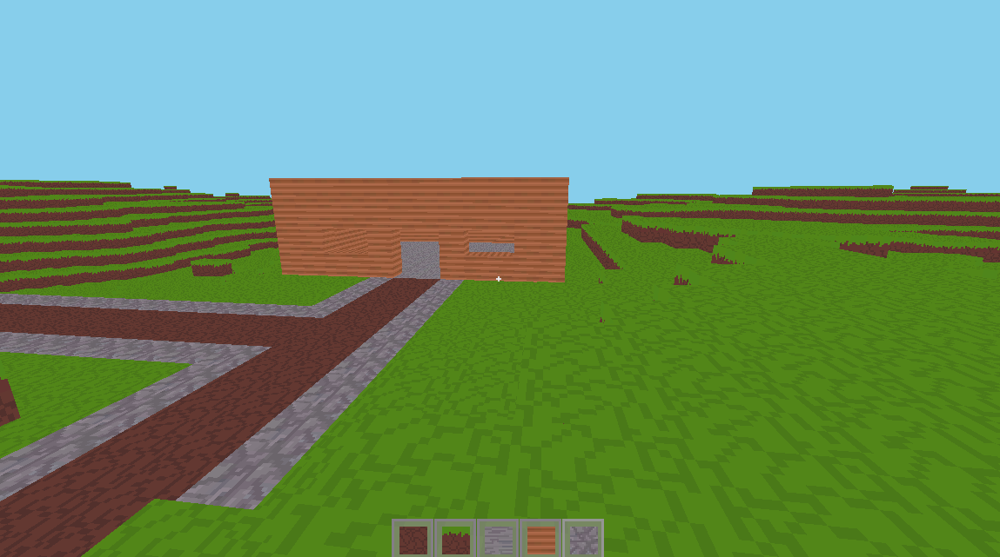

# Sam's Simple Voxel Engine (SSVE)

A Minecraft-style voxel engine prototype built in **Godot 4**, focusing on learning voxel terrain generation, chunking, and engine architecture.

---

### Roadmap / TODO

* ~~Basic voxel world generation~~

* ~~Chunk-based world loading & unloading~~

* ~~Chunk queue system with render distance~~

* ~~Asynchronous chunk generation using WorkerThreadPool~~

* ~~Main-thread–safe mesh building pipeline~~

* ~~Face culling using bitmasks~~

* ~~Raycast-based block selection~~

* ~~Block highlight / placement preview~~

* ~~Initial world loading gate before player spawn~~

* ~~User Interface with hotbar slots~~

* ~~More block types~~

* Trees

* Flowers

* Basic voxel lighting system

* ~~Block breaking & placement~~

* Save / load world data

* ~~Chunk prioritisation around player~~

* Mesh optimisation (greedy meshing)

* ~~Performance profiling & spike reduction~~

* Basic settings menu

---

> This project is primarily a learning exercise exploring voxel engines, data-oriented design, and Godot 4 multithreading.
